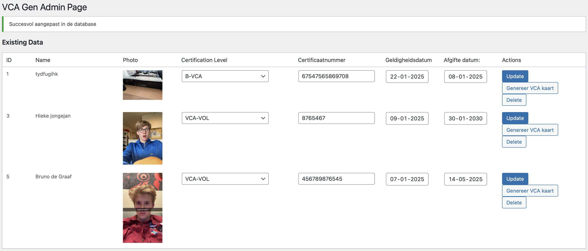
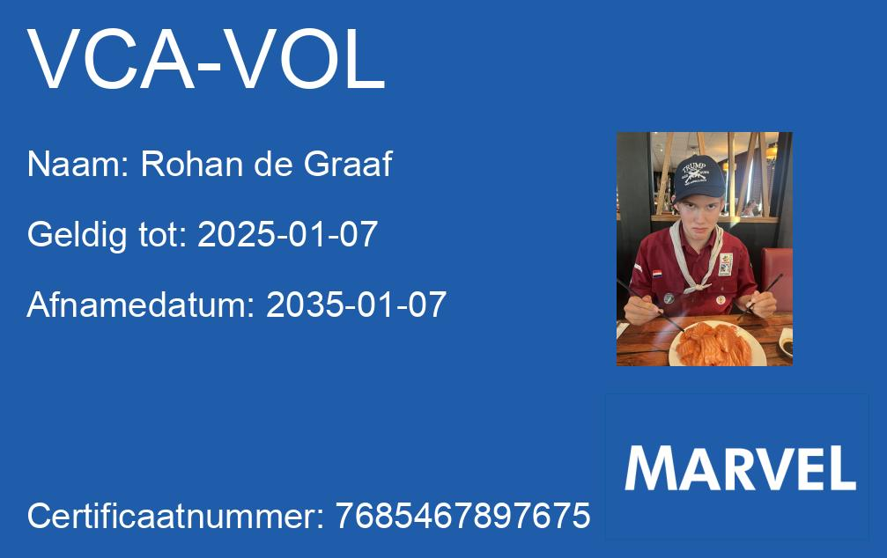

# VCA WP Generator

## Beschrijving
VCA WP Generator is een WordPress-plugin waarmee beheerders VCA-certificeringsgegevens voor gebruikers kunnen beheren.

## Functies
- Gebruikerscertificeringsgegevens toevoegen, bijwerken en verwijderen.
- Een visitekaartje in JPG-formaat genereren voor elke gebruiker met hun certificeringsgegevens.

## Installatie
1. Upload de release map naar de `/wp-content/plugins/` directory, of installeer de plugin direct via het WordPress-pluginscherm.
2. Activeer de plugin via het 'Plugins' scherm in WordPress.
3. Gebruik het 'VCA Gen' menu-item in de WordPress admin om toegang te krijgen tot de functionaliteit van de plugin.

## Gebruik
1. Navigeer naar de 'VCA Gen' admin pagina.
2. Bekijk en werk gebruikerscertificeringsgegevens bij.
3. Klik op de knop "Genereer Visitekaartje" om een JPG-bestand te downloaden met de certificeringsgegevens van de gebruiker.

